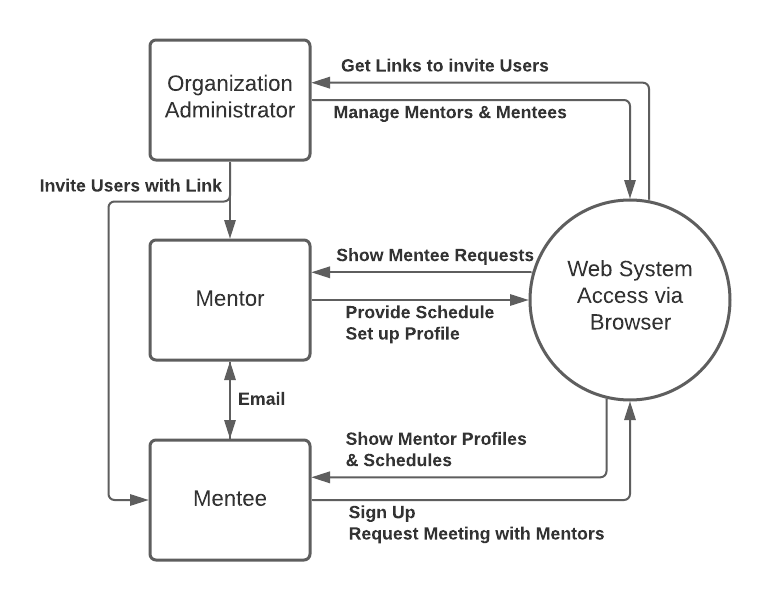
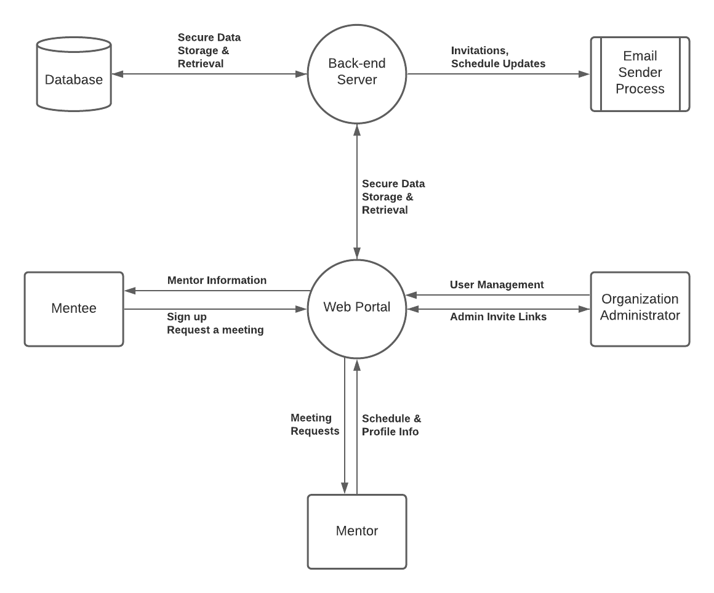

# Requirements Milestone

## Pace A

Mentor.io

## 1. High-level description

Mentor.io is an online mentorship platform for organizations and nonprofits that connects mentors and mentees. The platform will include an embeddable iframe form to fill out on the website for the mentors and mentees to sign up. There are 3 different user groups: mentor, mentee and admin. A mentor will be accepted by the admin based on the admins qualifications for their organization and provide the mentor access to the platform. The mentee could fill out the form and an email verification would then be needed to set up the profile. The admin is the final user group, after creating a private mentorship platform they will then have access to a sharable link to provide the mentors and mentees and have them sign up to their organizations secure platform, which also permits admins the ability to add and remove users at any time. After verifying the user’s profiles, the user could now log in and see their matched mentors and mentees based on their skills and interests that they provided on the sign-up form. The mentors could then pick times for their availability on the calendar on their profile, or their matched mentees could request a meeting for a certain time slot. The platform will then allow the users to share the provided email addresses with each other and establish their conversation via email.

## 2. Overview of your system architecture

### 2.1 Tech Stack

The client didn’t have many specific tech requirement constraints, other than that this was a web based application that needed some embeddable functionality. The application called for a front-end to provide the contents of the web portal, and a back-end to communicate and interface securely with a database. Below is a list of options we considered, with some pros and cons of each.

#### 2.1.1 Front End

**PHP:** PHP rendered HTML running on a linux/apache web server environment

*   Pros:	Lightning fast, great control over HTML content
*   Cons:	Difficult to set up complex systems, team has less experience

**Python:** Python web server

*   Pros:	Fast, powerful, easy DB integration, group is experienced in python
*   Cons:	Group is not experienced in python web development, lots of research required

**NodeJS/ReactJS:** A Node JS server running a ReactJS web client

*   Pros:	Flexible, rapid development via NPM modules
*   Cons:	JS dependent - browsers must enable JS, node modules require updates

#### 2.1.2 Back End

**PHP:** A web PHP server would communicate to itself via ajax and form submission in the client

*   Pros:	Easy to connect front end to back end, very fast
*   Cons:	Difficult to set up securely, harder to manage complex systems

**NodeJS/Express:** A NodeJS server running an express HTTP server for HTTP endpoints

*   Pros:	Fast development with node modules, well documented
*   Cons:	Node modules require updates

#### 2.1.3 Database

**Non-relational DB:** Google’s Firebase Firestore is an example of a non-relational database

*   Pros:	Easy to integrate via APIs, fast, easy usage, hosted, fast setup
*   Cons:	Non-relational (no SQL available), not free, not hosted in-house (google hosted)

**Relational DB:** MySQL, PostgreSQL, other relational databases

*   Pros:	Powerful SQL for complex systems, hostable in-house on a secure server
*   Cons:	More difficult to set up than non-relational DB

#### 2.1.4 Summary

The chosen stack for this project’s framework was a NodeJS/ReactJS front end, with a NodeJS/Express backend, using a relational DB. The primary reasoning for this was to support rapid development to allow for fast client feedback, and ease of development since both the front and back ends would be coded in a similar JS environment. A relational database was chosen to allow for more robust control over the complex data structures that were anticipated being in a time-scheduling application. The specific database that was chosen was PostgreSQL, since it has lots of features and is easily integrated into a Node based environment via the `pg` package.

### 2.2 Data Flow Diagrams

#### 2.2.1 Level 0 DFD

_Fig. 1 - The level 0 data flow diagram models how the different user groups interact with the system._

#### 2.2.2 Level 1 DFD

_Fig. 2 - The level 1 data flow diagram models how the different user groups interact with the system, and how the system internally communicates data._

## 3. System Requirements

### 3.1 Functional Requirements

#### 3.1.1 Peer Testing 1

1. Signup page.

Create separate signup pages for admins, mentors, and mentees all of which are initially greeted by a general sign up form unless invited privately by a business admin.

2. Admin invitation links

Business admins will be able to send email invitations through the web app. Anyone invited thought the link will be automatically sent to that business's signup page.

3. Email meeting requests

Mentees, once they find a mentor who they wish to connect with, will be able to send meetings requests to mentors.

#### 3.1.2 Peer Testing 2

4. Admin permissions and user management.

Business admins will have the ability to change certain aspects of their businesses’ account and the permissions of the accounts under it.

5. Mentor profiles with contact info, availability and skills

Mentor profiles will display their availability, contact info, and what topics are they able to mentor for.

6. Mentor - mentee matching algorithm

Once a mentee is taken through the signup process, they will be recommended mentors, who’s skills, and availability match up with theirs.

#### 3.1.3 Final Review

7. Able to run on most desktop browsers.

The web application should be able to run on most browsers. To reach 89.0% - 97.88% browser coverage the web app will need to run on Chrome, Safari, Firefox, Edge, IE, and Opera.

8. Time-zone handling.

Web app will be able to handle any timezone to coordinate meetings between mentors and mentees.

9. iFrame implementation

The web app will be able to run inside of an iFrame for easy implementation for customers.

### 3.2 Non-Functional Requirements

1. Handling of different languages
    1. The web app will have an option to be translated into different languages such as
        1. English
        2. French
        3. Spanish
        4. etc.
2. Cyber Security for user info storage
    2. Implementation of security measures into the web app.
3. Email verification
    3. Send email verifications when an account is created as a security measure.
4. Calendar availability GUI
    4. Implement a user friendly GUI of a mentor’s availability. This will be implemented in a mentor’s profile page.
5. Mobile browser capabilities
    5. Web app will be able to run in most mobile browsers. If developing also for mobile, need to run on Samsung Browser and UC to reach 97.9%-85.5% coverage.

### 3.3 Environmental Constraints

*   Able to run on most browsers (>85% browser coverage)
*   Able to run inside of an iFrame

## 4. Testing Strategy

### 4.1 Definitions

#### 4.1.1 Task

A unitary step in the process to completing a feature.  

#### 4.1.2 Unit

A piece of code which performs a single purpose or function.

#### 4.1.3 Developer

The person responsible for completing a task.

#### 4.1.4 Acceptance Criteria

High level list of criteria which a feature or task must satisfy in order to be accepted into the develop branch.

#### 4.1.5 Validation technique

The tool and type of test which is appropriate for satisfying the acceptance criteria.

#### 4.1.6 Acceptable coverage

The minimum code coverage which our testing should achieve. This is up to our discretion and should loosely be considered as 80-90%.

#### 4.1.7 Test suite

The set of all fast running unit and integration tests. The test suite is updated with the tests for each task as the task is completed.

#### 4.1.8 Manual review

A manual check to determine that a pull request satisfies the acceptance criteria of the task it claims to complete.

#### 4.1.9 Reason for rejection

The rationale of a reviewer for rejecting a pull request. A reason for rejection should include a suggestion for improvement or else the reviewer should contact the requester to discuss the issue.

#### 4.1.10 Mock

A mock is a replica that simulates the behaviour of an object. Mocks are used for testing to allow code to be tested without reliance on external systems.

### 4.2 Tools

#### 4.2.1 [Jest](https://jestjs.io/docs/en/getting-started)

Jest is a feature rich JavaScript testing framework which focuses on simplicity and efficiency. Jest will act as our main testing framework since it allows for easy mocking and provides rich context when tests fail. Jest is also very well documented making it easy for the team to learn it quickly. Jest makes regression testing React components fast and easy with snapshot testing. This way UI components can be tested automatically during the continuous integration process without wasting time building the app. Jest’s ability to work with webpack also makes it useful for our project.

#### 4.2.2 [React Testing Library](https://testing-library.com/docs/react-testing-library/intro)

The React Testing Library provides greater confidence when testing React components and makes code more maintainable. The library allows tests to work with the actual DOM nodes in the same way as the user. This allows for testing that is closer to the intended user experience. By combining the React Testing Library with Jest we will be able to test our frontend with confidence.

#### 4.2.3 [tSQLt](https://tsqlt.org/)

tSQLt is an SQL unit testing framework which we will be using to test our database. tSQLt automatically runs tests within transactions to reduce cleanup and provides mocking tools to allow for isolated testing. The framework can be integrated into our continuous integration workflow since output can be generated in both plain text and XML.

#### 4.2.4 [ESLint](https://eslint.org/docs/user-guide/getting-started)

ESLint is a JavaScript linting tool which can easily be integrated into our continuous integration pipeline. This tool will be used to ensure that all of our code follows the same standards and style guidelines.

#### 4.2.5 [GitHub Actions](https://docs.github.com/en/free-pro-team@latest/actions)

GitHub Actions will be used to automate the continuous integration process. This will be used to run regression testing and linting whenever code changes are suggested (whenever a pull request is created).  

### 4.3 Steps in the Testing Process

1. [All features are reduced to tasks.](#441-feature-reduction)

2. [Tasks are defined with a set of acceptance criteria and a validation technique.](#442-tasks-defined)

3. [The developer converts each of the acceptance criteria into tests according to the validation technique.](#443-conversion-of-acceptance-criteria)

4. [Code is written for the task until each of the tests pass with acceptable coverage.](#444-test-driven-development)

5. [Once each test passes both the code and its tests are pushed to the origin.](#445-push-to-origin)

6. [The developer creates a pull request to merge into the develop branch, causing the full test suite to be run, including regression testing.](#446-continuous-integration-regression-testing-and-linting)

7. [If there is a failure, the developer is responsible for troubleshooting.](#447-test-suite-fails)

8. [Once the test suite passes another member of the team will conduct a manual review.](#448-test-suite-passes)

9. [If the reviewer rejects the changes in the pull request, they should provide a reason for rejection.](#449-rejection-of-changes)

10. [If the reviewer approves the pull request, they should merge it into the develop branch.](#4410-approval-of-changes)

11. [Before each milestone, or at the request of the client, A full system test will be conducted on the develop branch.](#4411-system-testing)

12. [If there is a failure in the system testing a task should be created to address it.](#4412-system-test-fails)

13. [Successful system testing should result in a merge from the develop branch into the master branch.](#4413-system-test-passes)

14. [Acceptance testing can be performed on the master branch at any time.](#4414-acceptance-testing)

### 4.4 Each Step Explained

#### 4.4.1 Feature Reduction

**All features are reduced to tasks.**

Reduction of a feature into tasks can be done by any member of the team. However, The QA lead must review each task to determine that the completion of all of the tasks will satisfy the acceptance criteria of the feature.

#### 4.4.2 Tasks Defined

**Tasks are defined with a set of acceptance criteria and a validation technique.**

Acceptance criteria must be reviewed by the QA lead to determine whether they are a true representation of the task’s completion. The tool described in the validation technique is based on the language in which the code for the task will be written. The type of test required (unit or integration) will be obvious based on the nature of the task. The validation technique should also be reviewed by the QA lead.

#### 4.4.3 Conversion of Acceptance Criteria

**The developer converts each of the acceptance criteria into tests according to the validation technique.**

This is done before code is written for the task according to the test-driven development process. Only the external functionality of the code should be tested. In other words, tests should only be concerned with inputs and outputs and not with the internal workings of the code. This results in tests that are not broken by refactoring. Tests should make use of mocks to ensure that code is tested in isolation from external inputs. This means that code which relies on systems that have not yet been developed can be tested.

#### 4.4.4 Test-Driven Development

**Code is written for the task until each of the tests pass with acceptable coverage.**

This is a continuation of the test-driven development process. Coverage testing helps to ensure that each potential output is reachable by some input. High coverage is not sufficient to show that each logical path is being tested. If the acceptance criteria are robust and the conversion of acceptance criteria into tests is done properly then the logic of the task should be fully exhausted. It is the responsibility of the developer to determine whether they have done a proper conversion of the acceptance criteria into tests.

#### 4.4.5 Push to Origin

**Once each test passes both the code and its tests are pushed to the origin.**

Tests should be determined to pass manually on the developer’s local machine before pushing to origin.

#### 4.4.6 Continuous Integration, Regression Testing, and Linting

**The developer creates a pull request to merge into the develop branch, causing the full test suite to be run, including regression testing.**

This process allows changes to be continuously integrated into the code base without disrupting the workflow or breaking parts of the system that had previously been working. This also triggers the linting tool to be run, ensuring the newly integrated code meets the style standards of the rest of the code base.

#### 4.4.7 Test Suite Fails

**If there is a failure, the developer is responsible for troubleshooting.**

This may involve communication with other team members to discuss the problem and potential solutions. Manual testing may be necessary to help the developer better understand the problem.

#### 4.4.8 Test Suite Passes

**Once the test suite passes another member of the team will conduct a manual review.**

This involves studying the code to ensure that it does what the developer claims it does. The reviewer should also study the test cases that the developer has written to ensure that the acceptance criteria are being met.

#### 4.4.9 Rejection of Changes

**If the reviewer rejects the changes in the pull request, they should provide a reason for rejection.**

The reviewer should not reject the pull request without making the reason for rejection clear. This may include contacting the requester to discuss the issue and provide suggestions for improvement.

#### 4.4.10 Approval of Changes

**If the reviewer approves the pull request, they should merge it into the develop branch.**

With each of the previous steps being followed the develop branch should continuously be in a working state that is ready for system testing.

#### 4.4.11 System Testing

**Before each milestone, or at the request of the client, A full system test should be conducted on the develop branch.**

System testing will be a manual process which includes performing a full build of the system. This will mostly involve functional testing and usability testing. However, load testing and security testing may be done depending on what the software is intended to accomplish at the relevant milestone.

#### 4.4.12 System Test Fails

**If there is a failure in the system testing a task will be created to address it.**

Failures in system testing should be discussed by the group to determine potential fixes. Tasks created to fix problems found in system testing should be given priority to ensure the product can be delivered by the milestone deadline.

#### 4.4.13 System Test Passes

**Successful system testing will result in a merge from the develop branch into the master branch.**

With each of the previous steps being followed the master branch should always be in a state that has been fully unit, integration, and system tested.

#### 4.4.14 Acceptance Testing

**Acceptance testing can be performed on the master branch at any time.**

The client will always have access to a version of the software that they can test and provide feedback on via the master branch. The client can also request that the master branch be updated with the latest changes which will require a round of system testing (see step 11).

## 5. Questions and Answers

### 5.1 Questions About the High-Level Description

**Is this app intended to be used only internally within organizations or for the public at large as well?**

Organizations will have access to their own database of users. There will be a public version of the website which anyone is able to join.

**Would user profiles for mentors and mentees be handled by some kind of administrative account, or how would that data be handled/organized?**

The admin for an organization will have access to the list of mentors and mentees within that organization. The data itself will be handled by the database.

**What are the demographics for each user group?**

Admins are generally the heads of an organization. Mentors and mentees are considered as age 17+ members of the working population.

**Is the development team a user group?**

The development team is not considered a user group for the purposes of this project.

**A "matching algorithm" was discussed on the "Introduction" slide. What will you be considering in regards to weighting similarities to mentees and mentors to match the two?**

Mentors and mentees will be matched first on the number of skills they share and then on their shared time availability.

**How are your profiles going to be handled?**

User profiles will be stored in the database.

**How are you going to manage the questions that a user has to fill out, are you going to use a survey?**

This will be handled during the sign-up/registration process. Mentees will have to list the skills they are looking to be mentored on. Mentors will have to list the skills they are able to teach.

**Under what conditions would a mentor be accepted by an admin? What questions are asked to ensure capability of the mentor?**

Mentors will be known to the admin through the organization they are a part of. Admins will approve mentors under whatever conditions they wish to consider, however, these conditions will be unrelated to our program.

**How are mentors selected? Is it manual or based on an algorithm?**

Mentors sign up and are approved by the relevant admin. If a mentor signs up to the public site then no approval is necessary.

**How is the payment model implemented? I assume someone needs to pay for the servers.**

As the dev team we are not concerned with the payment model for the purposes of this project.

**Would you be the ones applying the mentee matching algorithms?**

Yes, we will be implementing the algorithm so that mentors are provided with a list of mentees with which they have matched.

**Why was the choice made to use email request meetings over any other method?**

Communication between mentors and mentees via email was the decision of the client. I believe this was for the sake of simplicity.

### 5.2 Questions About the System Architecture

**Do you have a website setup where the admin can login?**

Yes, the admin will be able to logic and view all of the mentors and mentees within the organization.

**For the level 0 DFD is there a good reason for the "back-end server" being split from the "web portal"?**

This is no longer the case.

**Is this being developed as a PWA?**

We are not planning to do this. However, if we find that we have an excess of time we may reconsider.

**What are the pros and cons of your tech stack?**

This is discussed

[here](#21-tech-stack).

**Did you guys choose the tech stack?**

Yes, we were given the go ahead by the client to choose the tech stack.

**Were any other tech stacks considered?**

[Yes](#21-tech-stack).

**What do you expect to use to host your completed project?**

Our completed project would likely be hosted on Heroku, same as where the backend will be hosted standardly. Or, if the client decides to use the project, then they would obviously find a hosting solution. The project will be built with configuration in mind (keeping all the URLs in one place, etc.)

**Will response design be utilized to create a mobile/desktop experience, or separate sites?

Responsive design will be used. This is another benefit that comes with our chosen tech stack, ReactJS components are very easy to use for this purpose.

**Where will you host your backend?

Several hosting options can work for us, and our decision is not yet finalized. But, we will likely use either Heroku or AWS. Heroku has the added benefit of a free managed PostgreSQL database.

**How will the database be accessed only through the back-end server?**

To accomplish this, we can essentially define a set of endpoints on the backend server to handle any database related tasks. Encapsulation, kind of like a bunch of specialized getters and setters. We can host the database on the same server machine that is running the server, in a separate process. This also provides the benefit that the client frontend server will never need the database credentials.

**Why did you choose to use PostgreSQL instead of MySQL or another relational model database?**

Partially for ease of implementation, as there is a readily available package we can use,  and partially since it is very feature rich. It has lots of newer features compared to other relational database systems, it’s focused on large scalability, and highly customizable (such as allowing you to define custom data types and indexes), so we thought it was a good solution that would hold well into the future. We also thought it would be good to work with and get to know for this same reason.

**What do you mean by iFrame capabilities?**

By this, we mean that part of the system is embeddable into an iframe on any standard HTML web page. This way things like a calendar widget are easy to add into an already existing page, all you need is the URL and some other parameters.

**Are there any technologies that any of you will be using for the first time in this project?**

PostgreSQL is one technology that no one in our team has used before. But, since it supports standard SQL queries and our team has experience with those, it shouldn’t pose too much of a problem, rather we can learn to use some of the new features PostgreSQL makes available.

### 5.3 Questions About Requirements

**Your first requirement is hard to understand. What do you mean by "most" browsers?**

Ideally the app will be deployable on any browser. If this is not possible within the time limit then we will aim to make it deployable on as many popular browsers as we can.

**What languages are you hoping to add support for? ****

The original version will be written in english. We plan to be capable of supporting every language that our chosen translation software supports. This functionality has not yet been fully researched.

**What are your priorities in terms of non-functional requirements such as security, simplicity, or learnability?**

If we reach a point where we begin implementing our non-functional requirements then which ones to prioritize will be discussed with the client at that time.

**2FA/password recovery for users?**

This may be considered if time allows.

**Do you plan on supporting Internet Explorer?**

Yes, we plan on supporting as many browsers as possible

**Are there any constraints for your system?**

Our system is constrained by its need to be embeddable in an iFrame and be runnable on most browsers.

**How will you ensure the security of your program?**

We will be implementing security features should time allow. The details regarding security have yet to be fully explored.

**Will there be a search function for searching specific users in the system?**

Admins will be capable of searching through a list of mentors and mentees in the system. Mentors will be capable of searching through a list of mentees they have matched with.

### 5.4 Questions About Testing

**Will you be using any linters?**

Yes, we will be using [ESLint](#424-eslint)

**How will you make sure that unit tests are constantly checked in the code base?**

We are using [GitHub Actions](#425-github-actions) to support continuous integration and regression testing.

**Do you feel that the advantages React-Testing-Library offers (over jest) will be worth the trade off of the extra time required to learn two different testing frameworks?**

The React Testing Library is not a testing framework on its own. It can be used without Jest but using the two in combination makes testing easy, efficient, and robust. It is also easy to learn and implement so this should not be an issue.

**How do you test your react components?**

React components will be tested both via snapshot testing and DOM element testing. This will be done using Jest and the React Testing Library.

**How do you know if your program is working on different browsers or not?**

The main tests for browser compatibility will be to build the system and run it on a browser to see if it works.

**How will you test the deployed version of the system?**

[System testing](#4411-system-testing) will mostly involve functional and usability testing.

**Are there any specific tools you will use to support you in Test-Driven Development?**

[Yes](#42-tools), we are using Jest and the React Testing Library to test our JavaScript and tSQLt to test our SQL.

### 5.5 Questions About Mentors and Mentees

**Who are mentors and who are mentees? What do they do?**

Mentors are users who possess some skill or set of skills which they are willing to teach. Mentees are users who desire to be taught skills. More information can be found in our [high-level description](#1-high-level-description).

**What sort of mentorship?**

Theoretically any type of mentorship could be supported by this program.

**Will a mentor be able to access a mentee's account?**

No, mentors will only have access to information about a mentee that is relevent to the mentorship. This includes email address, list of shared skills, and meeting times.

**Can someone be both a mentor and mentee?**

Yes, this will be possible in our system.

**Could you have multiple mentors?**

Yes, mentees can have multiple mentors to satisfy each of the skills they wish to develop.

**Can mentors have more than one mentee?**

Yes, mentors can choose any number of mentees.

**How do mentors and mentees interact within the app besides sending invites?**

Once a mentor has chosen a mentee they will communicate via email.

**What other information do you require from mentors and mentees other than calendar availability?**

Mentors list the skills they provide and mentees list the skills they wish to acquire.

**What incentive do mentors have?**

Mentors that are part of an organization are presumably incentivised to use the system by their superiors. We will not be providing any explicit incentives through the program.

### 5.6 Questions About the Lack of Items in our Presentation

**Where is the DFD level 1? (This question was asked 7 times)**

The DFD level 1 was not included in our video presentation but is [included](#222-level-1-dfd) in this report.

**How are you going to separate your functional requirements and features into Milestone deadlines? (This question was asked 5 times)**

This was not included in our video presentation but is included in this report. (link)

**Did you come up with 3 choices for the tech stack before you settled on the ones discussed in the presentation? If so, what were they? What were the downsides of the other technologies that lead you to your decision?**

Although not discussed in our presentation, we have listed a variety of [tech stack options](#21-tech-stack) along with pros and cons in this document.
